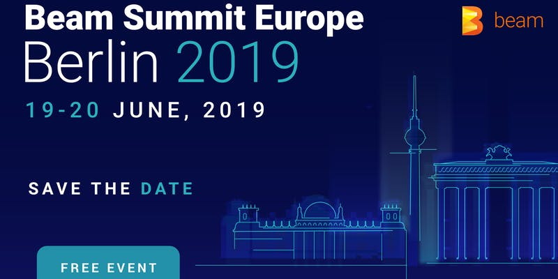

# Hands On With Beam Workshop (writing pipelines)

Welcome to the Intro to Beam Workshop for the Summit in Berlin : )
This workshop will explore the basic concepts of the Beam model and the Beam API in Python and Java. Unfortunately, no Go examples, but if you’re interested in the Go SDK, please check out [the Go Quickstart](https://beam.apache.org/get-started/quickstart-go/).

This workshop will be led largely by @pabloem.  @??(Reza), @??(Kannapan) leading the pattern sessions, and a bunch of others from the community helping out with instruction during hands-on sessions.  With @brucearctor facilitating.  

The schedule is to be as follows:

| TIME | Activity |
| :--- | :--- |
| 11:00 - 12:00 | Presentation on Beam SDK Tutorial |
| 12:00 - 12:30 |Loading and start working on the Beam Katas |
| 12:30 - 13:30 | Lunch (and work on the Katas with instructors) |
| 13:30 - 14:00 | Patterns from building some real world pipelines: prelude |
| 14:00 - 15:00 | Submitting Beam Jobs; Getting Setup for Prod, more Katas |
| 15:00 - 15:30 | Coffee Break (and continue above work, if desired/needed) |
| 15:30 - 16:00 | Patterns in building real world pipelines: detail |
| 16:00 - 17:00 | Beam in Production |

## **Requirements and setup** ##

This workshop relies on a few things that we recommend you install beforehand.

**Operating System Requirements**

The educational materials have been tested by us in Linux, Mac, and Windows.

Please setup the project using Java 8 only.

**IDE Requirements:**

* We rely on some of the JetBrains’ products. Specifically, we use:
  * **For Java:** IntelliJ
    * With the EduTools plugin: 
      https://www.jetbrains.com/education/download/#section=idea
  * **For Python:** PyCharm or IntelliJ with the Python plugin
    * With the EduTools Plugin: 
      https://www.jetbrains.com/education/download/#section=pycharm-edu
      
* If you’re not using the latest IntelliJ or PyCharm, please ensure that the EduTools plugin is version 2.5+

**Loading the coursework**
1. Upon opening the IDE, you can open the course by clicking
"Learn and Teach" > "Browse Courses".

2. Search and select the corresponding course
“Beam Kata - Java” for IntelliJ Edu
“Beam Kata - Python” for PyCharm Edu

See below for detailed screen shots.  

### Opening the Beam Katas ###
1. Upon opening the IDE, you can open the course by clicking "Learn and Teach" > "Browse Courses".
2. Search and select the corresponding course 
* “Beam Kata - Java” for IntelliJ Edu
* “Beam Kata - Python” for PyCharm Edu
3. Select your JDK or Python interpreter by expanding the “Advanced Settings”.
* Please use JDK 8 and Python 2.7 only.
* Then click "Join"
4. You're good to go.
* Note that for the first time, it will take some time to initialize the project.
5. To learn more on how to use the Education product:
* ["How To" IntelliJ Edu](https://www.jetbrains.com/help/education/learner-start-guide.html?section=Introduction%20to%20Java#explore_course)
* ["How To" PyCharm Edu](https://www.jetbrains.com/help/education/learner-start-guide.html?section=Introduction%20to%20Python#explore_course)
